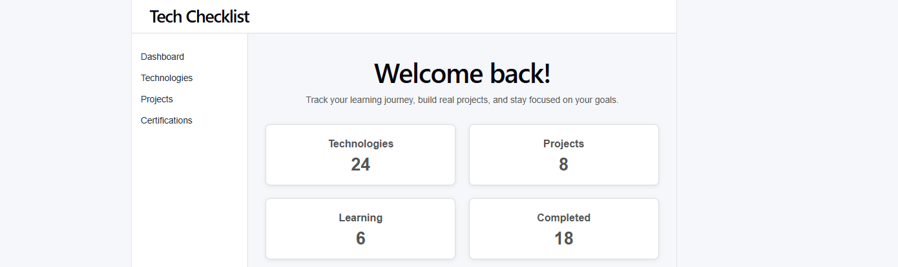
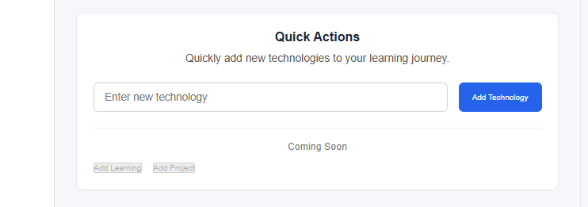
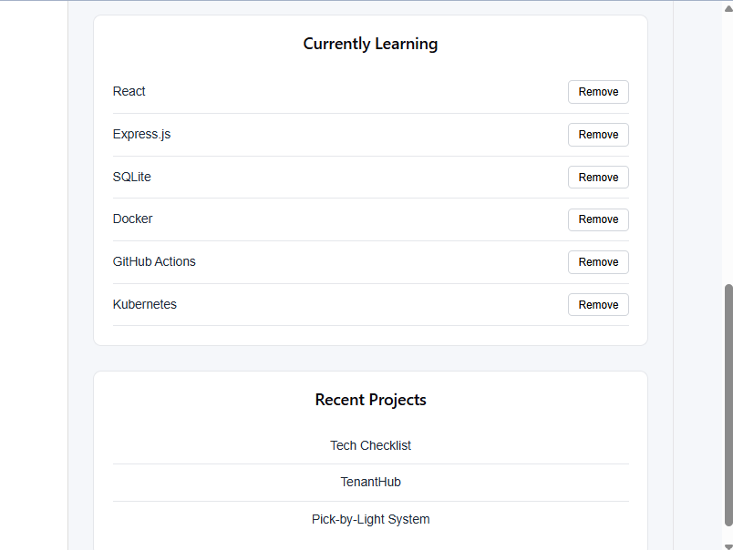

# Tech Checklist

> **A full-stack engineering workspace for software engineers and DevOps professionals to plan, organise, and track their technical learning journey.**


---

## Project Overview

Tech Checklist is a personal engineering workspace designed to help aspiring software engineers and DevOps professionals organise, manage and visualise their technical learning journey.

The application provides a central place to manage technologies, projects, certifications, learning goals and future objectives while encouraging structured, intentional learning rather than scattered notes.

Beyond solving a real productivity problem, this repository also serves as a portfolio project demonstrating modern software engineering practices including domain-driven modelling, component architecture, iterative development and DevOps workflows.

---

## Project Status

**Current Version:** Milestone 1 Complete

### Completed

- Dashboard UI
- Component-based architecture
- Technology management
- Domain-driven Technology model
- Duplicate prevention
- Responsive dashboard layout
- Docker support
- GitHub Actions CI pipeline

### In Progress

- Repository professionalisation
- Portfolio documentation

### Planned

- Express backend
- SQLite database
- Authentication
- Search & filtering
- Technology categories
- Project management
- Certification tracking

---

## Why I Built This

As my software engineering and DevOps learning expanded, I found it increasingly difficult to keep track of:

- technologies I had learned
- technologies I was currently studying
- projects I had completed
- certifications
- future learning goals

Rather than relying on multiple tools and scattered notes, I wanted to build one application that manages my learning journey while serving as a real-world full-stack engineering project.

---

## Features

### Dashboard

- Learning overview
- Dynamic summary cards
- Currently learning technologies
- Recent projects
- Live learning counter

### Technology Management

- Add technologies
- Remove technologies
- Duplicate prevention
- Domain-based data model

### Learning Organisation

- Technology categories
- Learning status
- Priority management
- Future roadmap planning

---

## Screenshots

### Dashboard Overview

The main dashboard provides a quick overview of the current learning journey, including active technologies, summary cards, and recent projects.



---

### Add Technology

Users can quickly add new technologies while duplicate entries are automatically prevented.



---

### Responsive Dashboard

The dashboard is designed to remain clean and usable across different screen sizes.



---

## Technology Stack

### Frontend

- React
- JavaScript (ES6+)
- Vite
- CSS

### Backend (Planned)

- Express.js

### Database (Planned)

- SQLite

### DevOps

- Docker
- Docker Compose
- Nginx
- GitHub Actions

---

## Software Architecture

```
React UI
      │
      ▼
Component Layer
      │
      ▼
Business Logic
      │
      ▼
Domain Model
      │
      ▼
Express API (Planned)
      │
      ▼
SQLite Database (Planned)
```

The project is intentionally developed using incremental architectural evolution. Each phase focuses on improving the design while preserving existing functionality.

---

## Engineering Principles

This project follows a set of engineering principles rather than focusing solely on implementation.

- Component-Based Architecture
- Separation of Concerns
- Single Source of Truth
- Domain-Driven Design
- Product-First Development
- Immutable State Updates
- Incremental Refactoring
- Design Before Implementation
- Small, Reversible Changes
- Behaviour-Preserving Refactoring

---

## Project Structure

```text
tech-checklist/
├── docs/
├── public/
├── src/
│   ├── components/
│   ├── constants/
│   ├── styles/
│   ├── pages/
│   ├── layouts/
│   ├── services/
│   ├── utils/
│   ├── App.jsx
│   └── main.jsx
├── Dockerfile
├── package.json
└── README.md
```

---

## Getting Started

### Prerequisites

- Node.js 20+
- npm
- Git

### Installation

```bash
git clone <repository-url>

cd tech-checklist

npm install

npm run dev
```

---

## Roadmap

### Milestone 1 ✅

- Dashboard
- Technology Management
- Domain Model
- Component Architecture
- CI Pipeline

### Milestone 2

- Categories
- Search
- Filtering
- Edit Technologies

### Milestone 3

- Express REST API
- SQLite
- Authentication
- User Accounts

---

## What I Learned

This project has strengthened my practical experience with:

- React component architecture
- State management
- Domain modelling
- Software design
- Git branching strategy
- Docker
- CI/CD with GitHub Actions
- Engineering documentation
- Product-oriented software development

---

## Author

**Jackson Itoro**

Digital Technology & Management Student

Aspiring Software Engineer | Backend & DevOps Enthusiast

---


## License

This project is licensed under the **MIT License**. See the [LICENSE](LICENSE) file for more information.

> **Tech Checklist is more than a learning tracker—it is a continuous software engineering project used to practise professional development workflows, software architecture and full-stack engineering.**